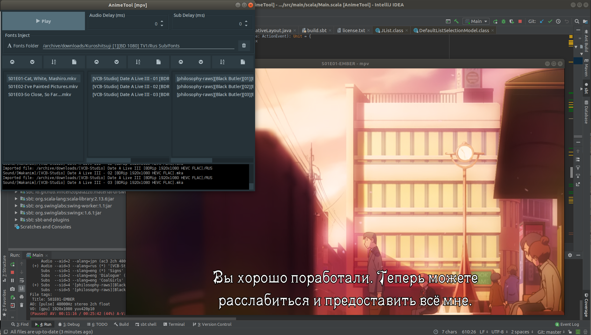

# Disclaimer

AnimeTool is pending ressurection now with manual concept

**Took me 2 years of mpv console arguments butthurt to start this again**

# Anime tool

Development in progress...

# Whats working

* mpv exectuion with all annoying arguments
* fonts injection before mpv execution and cleansing after mpv shutdown
* audio/sub delay per season
* lists management and sorting

# How to run
* jars not made yet. Will be made on release date. So if you want to use it now you need to compile the project
* right now only linux is supported
 
# How to use
* drop videos to first list
* drop audio to second list (if needed)
* drop subs to third list (if needed)
* align the lists so each video of the list matches the corresponding audio and subs
* drop fonts folder to corresponding panel (if supplied with your *LICENSED ANIME RIP THAT YOU PURCHASED LEGALLY* and if needed). If you need fonts injection. Fonts will be removed after you finish watching the episode and reinjected again on next episode
* if your audio/subs unsynced, after bruteforcing the value in mpv with hotkeys you can add that value to corresponding spinner field and this way it will apply for next episodes automatically

BTW with mpv you can use video-as-audio, or probably video-as-subs too. Just drop another video to audio or subs list, mpv will take it from container automatically

# Pending features
* Autosaving the state of the app so no need to remember what episode you watched last time
* Other players support beside mpv
* Archives support in **Fonts Folder** function, so it unpacks font archive automatically
* Windows support and windows builds (tho probably without fonts injection)

# Issues & collaboration
* if you experienced and issue - create the issue on github
* you can modify whatever and make pull request just be sure you tested it yourself. If it doesnt work properly for me - I wont accept pull request

