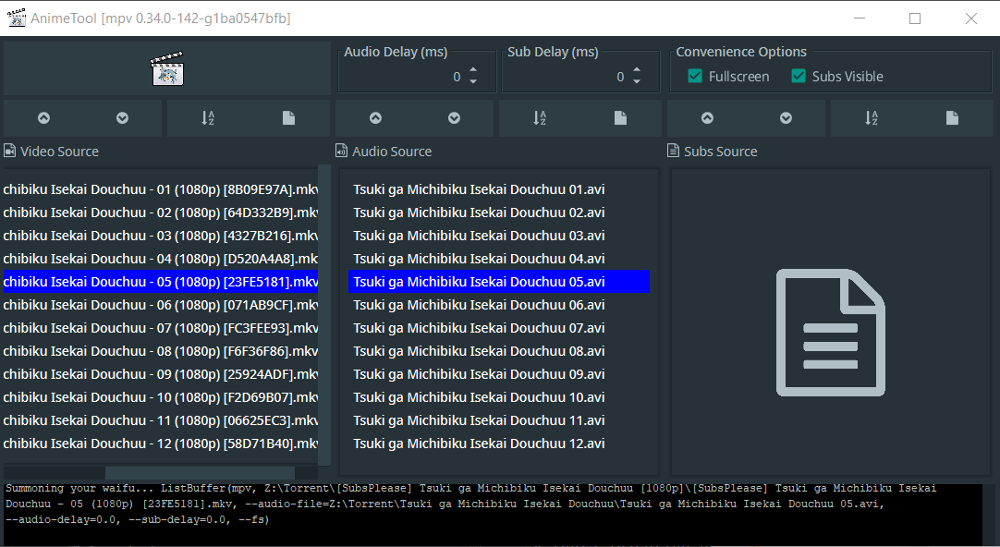

# Disclaimer

AnimeTool is pending ressurection now with manual concept

**Took me 2 years of mpv console arguments butthurt to start this again**

# AnimeTool

[Download latest Release From Here](https://github.com/POMATu/anime-tool/releases)

UI in Windows:

_Yes mate,_ **another video used as audio**

# Whats working

* mpv exectuion with all annoying arguments
* fonts injection before mpv execution and cleansing after mpv shutdown ***linux only***
* audio/sub delay per season
* lists management and sorting
* automatically start fullscreen option
* disable visibility of subs option (useful when container already has subs)

# How to run
### Linux/OSX
* Install Java with your package manager (openjdk/oracle-jre)
* Install MPV with your package manager
* Download a fat jar from [releases section](https://github.com/POMATu/anime-tool/releases)
* Run fat jar with java -jar AnimeTool.jar

### Windows
* Download .exe installer from [releases section](https://github.com/POMATu/anime-tool/releases)
* Install the app
* Run it with desktop or start menu shortcut
* If you wanna update - just download fresh installer, it will wipe previous version before installation
* If you wanna remove - you can do it with windows UI app uninstallation or by running unis000.exe in app folder
 
# How to use
* drop video sources to first list
* drop audio sources to second list (if needed)
* drop subs sources to third list (if needed)
* align the lists so each video of the list matches the corresponding audio and subs
* select fullscreen or no subs options if you need
* ***Linux Only*** drop fonts folder to corresponding panel (if supplied with your *LICENSED ANIME RIP THAT YOU PURCHASED LEGALLY* and if needed). If you need fonts injection. Fonts will be removed after you finish watching the episode and reinjected again on next episode
* if your audio/subs unsynced, after bruteforcing the value in mpv with hotkeys you can add that value to corresponding spinner field and this way it will apply for next episodes automatically

BTW with mpv you can use video-as-audio, or probably video-as-subs too. Just drop another video to audio or subs list, mpv will take it from container automatically

Keep in mind it plays only selected fields, so if you deselected something - you need to select rows again 

# How to control MPV with hotkeys
* q - exit
* m - mute/unmute
* arrows - fast forward/backward
* \# - switch audio track or disable
* j - switch subtitle track or disable
* v - toggle subtitle visibility
* [ and ] - control speed (for boring titles)
* z and x - control sub delay
* Ctrl - / Ctrl + - control audio delay

After you bruteforce audio/sub delays you can put exact ms value displayed on screen to the corresponding fields in AnimeTool so it applies for whole season of your fucked chunked anime season setup

* [You can read more hotkeys here](https://defkey.com/mpv-media-player-shortcuts)
* [Or even here but thats too much RTFM](https://mpv.io/manual/master/)

# Pending features
* Autosaving the state of the app so no need to remember what episode you watched last time
* Archives support in **Fonts Folder** function, so it unpacks font archive automatically

# Issues & collaboration
* if you experienced and issue - create the issue on github
* you can modify whatever and make pull request just be sure you tested it yourself. If it doesnt work properly for me - I wont accept pull request

